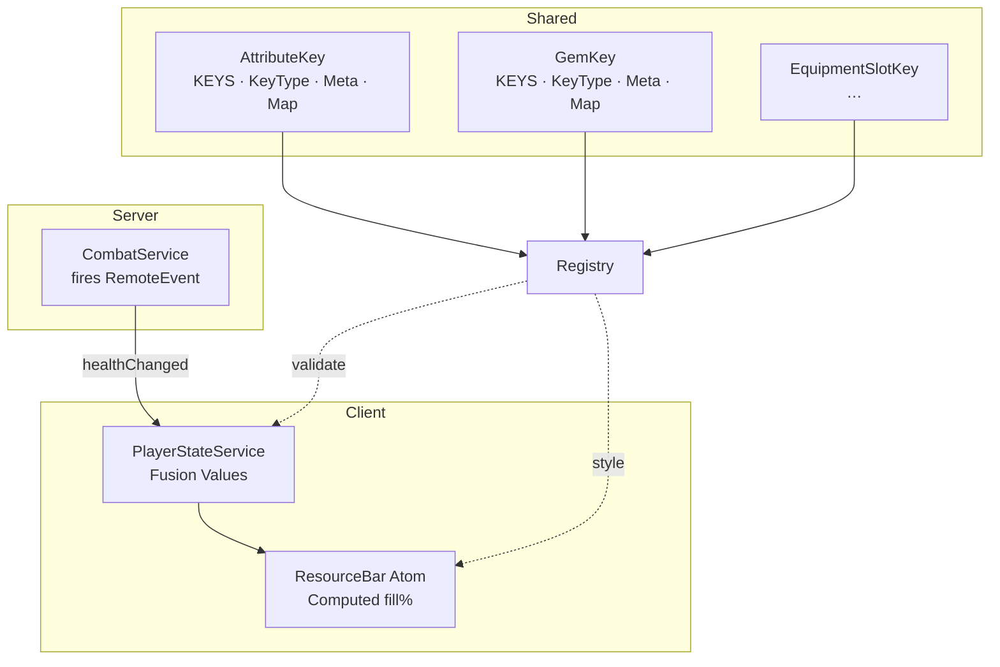

# AGENTS.md

The purpose of this document is to provide a concise overview of coding conventions, testing practices, and agent directives for the Soul Steel project. It serves as a quick reference for developers and LLM or AGI's to ensure consistency and quality in their contributions.

## 0. Important Notes

1. **Navigation FYI**: When searching for files and folders please note that the folder structure is deep. For example, the Progression.ts file is located at `src/shared/definitions/ProfileDefinitions/Progression.ts`. The `shared` folder is the root for all shared code, and the `src` folder is the root for all source code.

2. **Design Patterns**. Example systems include:
   - **Network -> Dispatch && Network -> Listener**: From `shared/network/Network.ts` for ClientDispatch and ServerDispatch represent Events and Functions that can be called from the client or server. Those events and functions are listened to by a single client or server listener, which is responsible for handling the events and functions. Events are dispatched using a single module for the client and server, which is responsible for dispatching the events and functions to their respective listeners.
   - **State System**: The client listener listens for events and updates the `PlayerState` service and future state slices, which is a Fusion Value that holds the current state of the player. This service is used to store and manage the player's state, such as health, mana, and other attributes.
   - **Shared - Keys Meta DTO Foundation**: For handling combat-related events and data.
   - **Atomic Fusion State System**: For displaying resource bars in the UI.

## 1 Follow Coding Conventions

1. Use PascalCase for FusionComponents.
2. Section modules with spanning comment blocks.

## 2 General Workflow

1. **Commenting Requirements**: Follow the commenting conventions outlined in the [Commenting Guide](./Documents/CommentingGuide.md). This includes using TSDoc comments for all public modules, classes, and functions, as well as documenting parameters, return values, and exceptions.
   - Use `@file`, `@module`, and `@layer` tags to specify the file's purpose, module, and layer.
    - Use `@author`, `@license`, and `@since` tags to provide author information, license details, and versioning.  
    - Use `@dependencies` to list any external dependencies required by the module.
2. **Barrel Modules**: Ensure folders contain barrel files for easy imports. Check existing folders and ensure barrel files are present and correctly exporting components. New folders added to this repo already include an `index.ts` barrel.
3. **Asset Use and Management**: Use available assets from the `shared/assets` folder. If an asset is not available, create a placeholder asset and a #ASSETREQUEST comment in the code to request the asset from the art team.
4. **Agent-Created Atoms**: If you identify a core (atomic) component that is missing, create a new file in the `src/atoms` folder and follow the coding conventions outlined in this guide. add a #AGENT_ATOM comment to the top of the file to indicate it is an agent-created atom.
5. **USE and ADD Keys as master reference**: When creating components, use the `Key` type from `shared/data` as the master reference for keys. This ensures consistency across the codebase. If a key is not available, create a new key in the `shared/data` folder and add it to the `Key` type.
6. **Documentation**: Use TSDoc comments to document components, including their purpose, properties, and events. This helps maintain clarity and understanding of the codebase.
7. **Check the AGENTS_TODO.md file** for any additional tasks or components that need to be created. This file serves as a central place for tracking agent-created components and tasks.

## 3 Pitfalls to Avoid

**Fusion Event Calling Style**: Fusions OnEvent, OnChange follow the format: (keep in mind not all events or properties will be used in every component - A framebased component may not use OnEvent("Activated") but a GUIButton based component will, for example):

```ts
    MyComponent({
    ...otherProps,
    [OnEvent("EventName")]: (eventData) => {
        // Handle event
    },
    [OnChange("PropertyName")]: (newValue) => {
        // Handle property change
    },
})
```

**Avoid nil checks using `if(!value)` or `if(value == null)`**. Instead, use `if(value === undefined)` to check for specific nil values. This ensures that you are explicitly checking for the intended value and not inadvertently allowing other falsy values to pass through.

## 4 Code Header Style

*Prepend the full TSDoc header template (see Appendix A) whenever you create a new `.ts` file.*

```ts
/// <reference types="@rbxts/types" />

/**
 * @file        HealthBarAtom.ts
 * @module      HealthBarAtom
 * @layer       Atom
 * @description Fusion atom that renders a segmented health bar for characters.
 *
 * ╭───────────────────────────────╮
 * │  Soul Steel · Coding Guide    │
 * │  Fusion v4 · Strict TS · ECS  │
 * ╰───────────────────────────────╯
 *
 * @author       Trembus
 * @license      MIT
 * @since        0.2.0
 * @lastUpdated  2025-05-29 by Luminesa – Initial creation
 *
 * @dependencies
 *   @rbxts/fusion ^0.4.0
 *
 * @remarks
 *   Uses them  from shared/quarks.ts.
 */

import Fusion from "@rbxts/fusion";
// …component code…
```

## 5 Development Summary

1. Maintain `AGENTS_DEVELOPMENT_SUMMARY.md` in the `src` folder.
2. Update this summary whenever code is added or modified.
3. List each module under its Network Layer (`client`, `server`, `shared`) and assign a status:
   - **Rock Solid** – production ready
   - **Usable** – works but can be improved
   - **Under Construction** – partial functionality
   - **Stub** – placeholder logic
4. Use the summary as a quick reference for future agents.

## 6 Additional References

1. [AGENTS_DEVELOPMENT_SUMMARY.md](./src/AGENTS_DEVELOPMENT_SUMMARY.md) – for tracking module status and updates.
2. [Commenting Guide](./Documents/CommentingGuide.md) – for understanding the commenting conventions and TSDoc style rules.
3. [Organism Structure Guide](./Documents/OrganismStructure.md) – for understanding the structure and conventions of Fusion organisms and commenting examples.
4. [Fusion Event Guide](./Documents/FusionEventGuide.md) – for understanding event handling and syntax.
5. [AGENTS_TODO.md](./src/AGENTS_TODO.md) – for tracking tasks and components to be created by agents.
6. [AGENTS_TASK_TEMPLATE.md](./src/AGENTS_TASK_TEMPLATE.md) – for creating new tasks and components.
7. [Tasks Folder](./tasks) – for storing tasks and components created by agents. and using the new task system.

## 7 CodexUtility Section

A workspace-level folder named `codexUtility` houses automation scripts and utilities that operate on both the TypeScript source (`src/`) and the compiled Lua output (`out/`), as well as project configuration and packaging files.

> **Location:** `/codexUtility`
>
> **Purpose:** Store CLI and Node.js scripts (e.g. build helpers, config updaters, packaging tools) to streamline development workflows.
>
> **Conventions:**
>
> - Name scripts in camelCase (e.g. `syncConfig.js`, `generatePackageManifest.js`).
> - Include a top-level JSDoc comment block in each script.
> - Update this section when adding new utility scripts.

> **Current scripts:**
>
> - `runTests.js`: Builds the project and runs all spec.ts tests via `npm test`.

## Appendix A: Mermaid Flowchart


