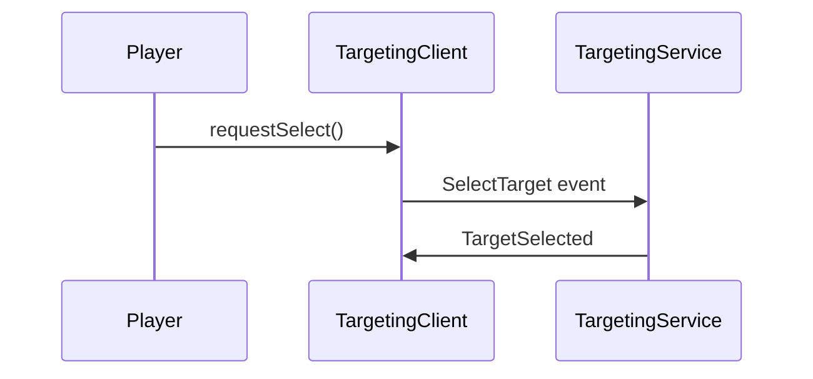

# Targeting System

This document outlines the cross-platform targeting system used in Soul Steel.

## Overview

Players can select a single in-world entity. Combat and UI consume the current target to drive melee attacks and highlight logic. Selection is replicated through rbxts-net events.

```
Player Input -> TargetingClient -> TargetingService -> TargetSelected event -> UI
```

## Usage

```ts
const target = Targeting.getTarget();
if (target) {
  CombatService.startAttack(player, target);
}
```

## Sequence Diagram



